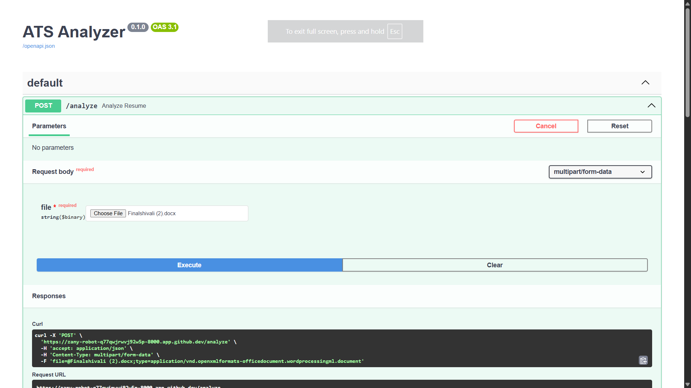
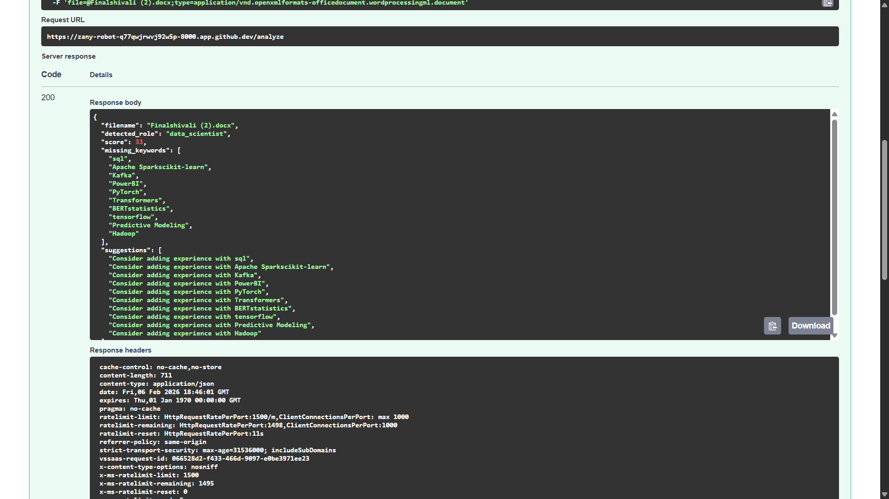

# Role-Aware ATS Analyzer — FastAPI Backend with CI/CD & DevSecOps
Built a role-aware ATS backend using FastAPI that analyzes resumes, detects job roles, scores skill alignment, and enforces quality via CI/CD pipelines, testing, linting, security scanning, and Dockerized runtime.

# ATS Analyzer (Role-Aware, Rule-Based)

A backend ATS (Applicant Tracking System) analyzer that:
- Accepts resumes (PDF / DOCX)
- Detects the most likely job role
- Scores resumes against role-specific skills
- Returns missing skills and improvement suggestions

Built with FastAPI, designed with DevOps best practices.
---
## 🚀 Features

- Resume upload (`POST /analyze`)
- Role detection (Data Scientist / DevOps / Full Stack)
- Explainable, rule-based ATS scoring (no AI, no paid APIs)
- Structured logging & request tracing
- Unit-tested business logic

---

## 🛠 Tech Stack

- FastAPI
- Python 3.12
- Pytest + Ruff
- Rule-based ATS engine
- GitHub Codespaces ready

---
## 📸 Screenshots

## 📦 How to Run Locally

## pip install -r requirements.txt
## cp .env.example .env
## uvicorn app.main:app --reload

## How to Use the API
Analyze a Resume

Endpoint

POST /analyze

Input

multipart/form-data

Field: file (PDF or DOCX)

# Sample Response

{
  "filename": "resume.pdf",
  "detected_role": "data_scientist",
  "score": 68,
  "missing_keywords": ["tensorflow", "statistics"],
  "suggestions": [
    "Consider adding experience with tensorflow",
    "Mention statistics or probability work"
  ]
}

# How Role Detection Works (No AI)

The system scans resume text

Matches keywords against predefined role skill maps

Selects the role with highest relevance

Scores only against that role

This makes the system:

Free

Explainable

Deterministic

🧪 Testing
pytest
ruff check .

📈 Project Roadmap

✅ Phase 0–3: Backend, ATS logic, testing

⏭ Phase 4: CI/CD + security scanning

⏭ Phase 5: Docker & IaC

⏭ Phase 6+: Cloud deployment (optional)

👤 Author -
## Adharsh U
Built by Adharsh U as a backend + DevOps portfolio project.

